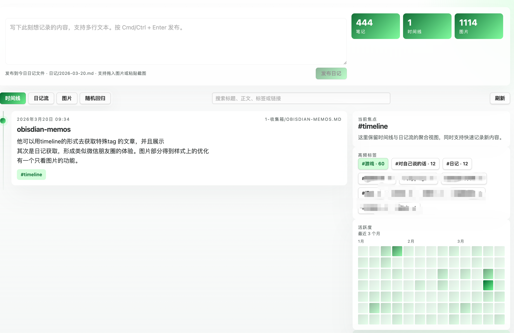

# Memo Timeline Feed

Author: `lbb2445`

Memo Timeline Feed 是一个面向 Obsidian 的内容展示插件，用更强的视觉化方式重新组织笔记、日记和图片内容。

它的目标不是替代 Obsidian 原生笔记列表，而是给你的 memo、时间轴记录、日记和图片内容提供一个更适合“浏览”和“回顾”的界面。

## 界面截图

## 核心功能

### 1. Timeline 时间轴视图

- 自动扫描带有 `#timeline` 的笔记
- 按时间倒序排列内容
- 展示标题、时间、路径、摘要、标签和图片预览
- 适合记录事件、阶段进展、人生轨迹、项目里程碑

### 2. Diary Feed 日记流视图

- 自动识别日记类笔记
- 支持通过日记标签、日记文件夹、日期文件名规则进行筛选
- 以类似微信朋友圈的信息流方式展示内容
- 卡片中可展示正文摘要、图片宫格、标签和跳转入口

### 3. Photos 只看图片模式

- 从笔记中提取图片资源
- 支持 `![[image.png]]` 和 `` 两种图片写法
- 将所有图片集中成独立图片墙
- 适合快速浏览相册、视觉素材、生活记录

### 4. Obsidian 内部可配置

- 可自定义 Timeline 标签
- 可自定义 Diary 标签
- 可指定 Diary 文件夹
- 可设置日记文件名匹配规则
- 可限制最大渲染卡片数量

### 5. 参考稿风格的 UI 呈现

- 基于你提供的参考 zip 重新实现 Obsidian 内视图
- 采用绿色系、白色卡片、大留白、轻玻璃感的视觉语言
- 在 Obsidian 中提供更像内容画廊而不是传统列表的阅读体验

## 安装方式

将以下文件复制到你的 Obsidian Vault 插件目录中：

- `manifest.json`
- `main.js`
- `styles.css`
- `versions.json`

目录建议：

`<your-vault>/.obsidian/plugins/memo-timeline-feed/`

然后在 Obsidian 的社区插件中启用 **Memo Timeline Feed**。

## 使用方式

1. 在你想进入时间轴的笔记中添加 `#timeline`
2. 在日记笔记中使用 `#diary`，或者把它们放进你设置的日记文件夹
3. 在笔记中插入图片，例如 `![[image.png]]` 或 ``
4. 在 Obsidian 中执行命令 `Open memo timeline feed`
5. 在视图里切换 `Timeline`、`Diary Feed`、`Photos`

## 插件设置

- `Timeline tag`：定义哪些笔记进入时间轴
- `Diary tag`：定义哪些笔记进入日记流
- `Diary folder`：指定一个目录作为日记来源
- `Daily note filename pattern`：通过正则识别日期型日记文件名
- `Maximum cards`：限制页面最大渲染卡片数量

## 数据来源规则

- Timeline 笔记：匹配配置中的 `timelineTag`
- Diary 笔记：匹配配置中的 `diaryTag`，或位于指定文件夹内，或文件名符合日记正则
- 图片内容：从 Markdown 图片嵌入语法中提取

## 当前适合的使用场景

- 时间轴记录
- 日记流展示
- 图片日记 / 视觉相册
- 个人 memo 的沉浸式浏览

## 发布检查

当前仓库已经包含 Obsidian 社区插件提交前要求的核心文件：

- `README.md`
- `LICENSE`
- `manifest.json`
- `main.js`
- `styles.css`

如果要正式提交到 Obsidian 社区插件目录，下一步还需要：

1. 在 GitHub 上创建 `1.0.0` release
2. 保证 release tag 与 `manifest.json` 中的版本一致
3. 将 `main.js`、`manifest.json`、`styles.css` 上传为 release 附件
4. 到 `obsidian-releases` 仓库的 `community-plugins.json` 新增插件条目
5. 创建 PR，标题使用 `Add plugin: Memo Timeline Feed`
